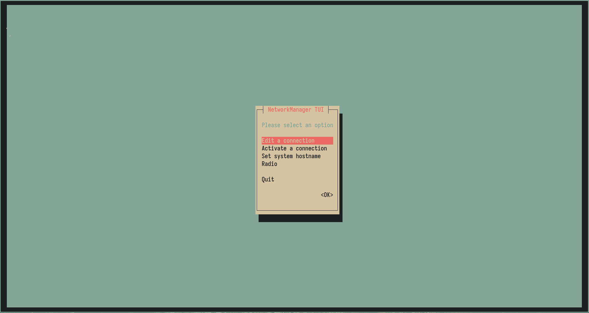
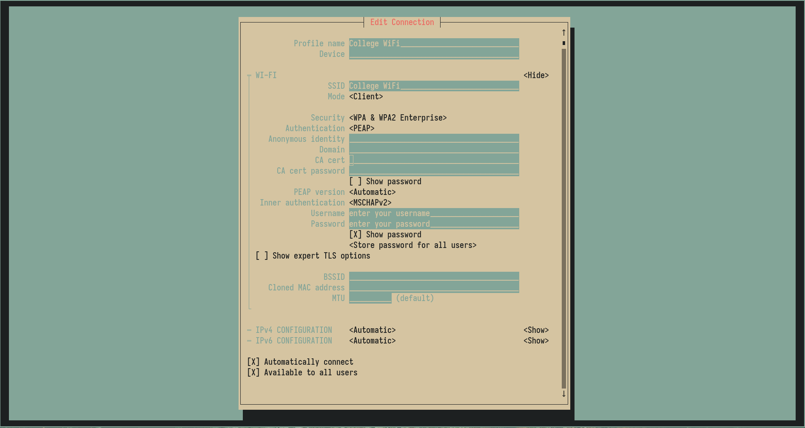
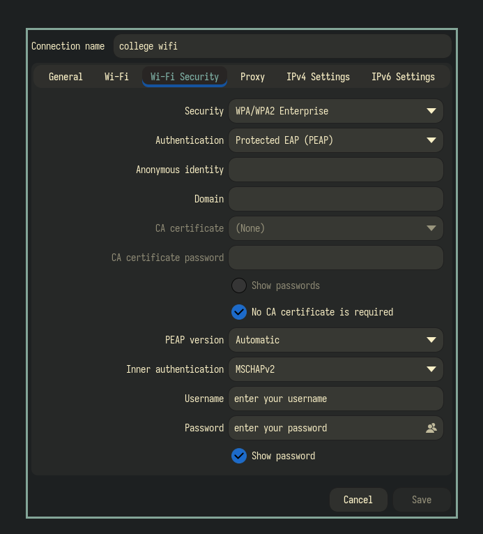

## Connecting to college WiFi using nmtui

**Step 1:** Open a terminal and run `nmtui` and in the selection navigate to `activate a connection`

**Step 2:** From the list, select the WiFi you want to connect to.

**Step 3:** You'll be taken to a screen similar to the one below:

**Step 4:** Verify that the SSID matches the network you want to connect to, then configure the settings below:
- Authentication -> PEAP (Protected PEAP)
- Anonymous Identity -> Nil
- Domain -> Nil
- CA cert -> Nil
- CA cert password -> Nil
- Inner authentication -> MSCHAPV2

**Step 5:** After configuring the settings as said below, enter your username and password and press enter.

Following the above steps will get you connected to the college WiFi. If you feel difficult to connect through the terminal interface. Refer to GUI method below.

## Connecting to college WiFi using NetworkManager GUI

**Step 1:** Open the application -> **Advanced Network Configuration**

**Step 2:** From the dropdown menu, Select WiFi and enter *Create...*

**Step 2:** Under the *WiFi* tab, enter the name of the WiFi connection that you want to connect to in the SSID field.

**Step 3:** Now after that go to the *WiFi Security* tab, you'll see a configuration window similar to the one below:

**Step 4:** Under *WiFi Security*, check if SSID is the network you want to connect to under the *WiFi* tab and after that under the *WiFi Security* tab change the settings to the one below:
- Security -> WPA/WPA2 Enterprise
- Authentication -> PEAP (Protected PEAP)
- Anonymous Identity -> Nil
- Domain -> Nil
- Check the "`No CA certificate is required`" checkbox
- CA cert -> Nil
- CA cert password -> Nil
- Inner authentication -> MSCHAPV2

**Step 5:** After configuring the settings as said below, enter your username and password and press enter.

Following these steps will get you connected to the college WiFi
